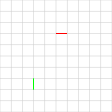
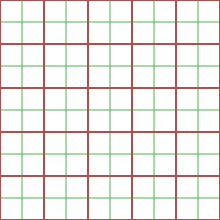
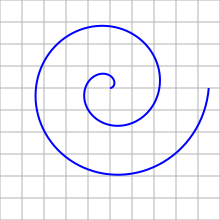
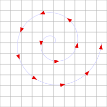
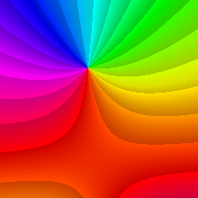

# [ Painter](./Painter.md)

Painters have the ability to "draw"/"paint" something inside objects with math coordinate systems (e.g. `CV_Math2DCanvas`).

## Quick links

| "area" painters                                                                                                                                | curve  painters                                                                                                                        | other painters                                                                                                                           |
|:---------------------------------------------------------------------------------------------------------------------------------------------- |:-------------------------------------------------------------------------------------------------------------------------------------- |:---------------------------------------------------------------------------------------------------------------------------------------- |
|  [`CV_FillPainter`](./Painter.md#user-content-cv_fillpainter)                 |  [`CV_LinePainter`](./Painter.md#user-content-cv_linepainter)         |  [`CV_ValueMarkPainter`](./Painter.md#user-content-cv_valuemarkpainter) |
|  [`CV_PortraitPainter`](./Painter.md#user-content-cv_portraitpainter) |  [`CV_DirectionPainter`](./Painter.md#user-content-cv_directionpainter) |  [`CV_GridPainter`](./Painter.md#user-content-cv_gridpainter)           |

## `CV_FillPainter`

```
CV_FillPainter <: CV_2DCanvasPainter
    no fields
```

A painter filling the complete canvas.

A `CV_ContextStyle` is typically used to govern the appearance of the filling operation.

## Example for `CV_FillPainter`


```julia
function example_fill_painter()
    math_canvas = CV_Math2DCanvas(0.0 + 1.0im, 1.0 + 0.0im, 220)

    fill_painter = CV_FillPainter()
    styled_painter = cv_color(0.7, 0.4, 0.4) ↦ fill_painter
    
    cv_create_context(math_canvas) do canvas_context
        cv_paint(canvas_context, styled_painter)
    end

    return math_canvas
end
```

## `CV_ValueMarkPainter`

```
CV_ValueMarkPainter{N<:Number}
    where     CV_TranslateByOffset{N}
    start     Float64
    len       Float64
    vertical  Bool
```

A painter drawing a vertical line-segment `(where, start)` to `(where, start + len)` (in the math coordinate system). Here the `where` is the where-value of a `CV_TranslateByOffset`. If `vertical` is `true` then the real- and imag-coordinates are swapped for drawing.

This painter is typically used for Sliders to mark the current slider position.

## Example for `CV_ValueMarkPainter`



```julia
function example_mark_painter()
    math_canvas = CV_Math2DCanvas(0.0 + 1.0im, 1.0 + 0.0im, 220)

    x_pos, y_pos = CV_TranslateByOffset(Float64), CV_TranslateByOffset(Float64)
    x_pos.value, y_pos.value = 0.7, 0.3

    bg_fill = cv_white ↦ CV_FillPainter()  # for background
    grid_style = cv_color(0.8, 0.8, 0.8) → cv_linewidth(1)
    grid = grid_style ↦ CV_GridPainter(0.0:0.1:1.0, 0.0:0.1:1.0)
    horiz_mark = CV_ValueMarkPainter(x_pos, 0.5, 0.1, true)
    vert_mark = CV_ValueMarkPainter(y_pos, 0.2, 0.1, false)

    h_painter = (cv_color(1,0,0) → cv_linewidth(2)) ↦ horiz_mark
    v_painter = (cv_color(0,1,0) → cv_linewidth(2)) ↦ vert_mark

    cv_create_context(math_canvas) do canvas_context
        cv_paint(canvas_context, bg_fill)
        cv_paint(canvas_context, grid)
        cv_paint(canvas_context, h_painter)
        cv_paint(canvas_context, v_painter)
    end

    return math_canvas
end
```

## `CV_GridPainter`

```
CV_GridPainter <: CV_2DCanvasPainter
    reals   Vector{Float64}
    imags   Vector{Float64}
```

A painter for drawing horizontal and vertical grid lines.

`CV_GridPainter(reals, imags)`

```
reals    Union{NTuple{N, Real}, AbstractVector{Float64}}
imags    Union{NTuple{M, Real}, AbstractVector{Float64}}
```

construct grid for given real- and imag-values.

## Example for `CV_GridPainter`



```julia
function example_grid_painter()
    math_canvas = CV_Math2DCanvas(0.0 + 1.0im, 1.0 + 0.0im, 220)

    bg_fill = cv_white ↦ CV_FillPainter()  # for background

    style1 = cv_color(0.7, 0.3, 0.3) → cv_linewidth(2)
    grid1 = style1 ↦ CV_GridPainter(0.0:0.2:1.0, 0.0:0.2:1.0)

    style2 = cv_color(0.3, 0.7, 0.3) → cv_linewidth(1)
    grid2 = style2 ↦ CV_GridPainter(0.1:0.2:0.9, 0.1:0.2:0.9)

    cv_create_context(math_canvas) do canvas_context
        cv_paint(canvas_context, bg_fill)
        cv_paint(canvas_context, grid2)
        cv_paint(canvas_context, grid1)
    end

    return math_canvas
end
```

## `CV_LinePainter`

```
CV_LinePainter{dtrafoT, strafoT, scutT} <: CV_2DCanvasPainter
    dst_trafo           dtrafoT
    segments            CV_LineSegments
    auto_close_path     Bool
    src_trafo           strafoT
    src_cut_test        scutT
```

Painting `CV_LineSegments` as curves.

All the points of the line segments are transformed according to `dst_trafo`.

The preimage of the line segments are transformed by `src_trafo` (unless `src_trafo === nothing`) and afterwards they are checked with `src_cut_test` (unless `src_cut_test === nothing`) if the line-segment needs to be "cut" (i.e. the line is interrupted there).

```
CV_LinePainter(dst_trafo, segments, auto_close_path=false)
    dst_trafo
    segments           CV_LineSegments
    auto_close_path    Bool
```

with `src_trafo` and `src_cut_test` both `nothing`.

```
CV_LinePainter(segments, auto_close_path=false)
    segments           CV_LineSegments
    auto_close_path    Bool
```

`dst_trafo = identity` and with `src_trafo` and `src_cut_test` both `nothing`.

## Example for `CV_LinePainter`



```julia
function example_line_painter()
    math_canvas = CV_Math2DCanvas(-1.0 + 1.0im, 1.0 + -1.0im, 110)
    bg_fill = cv_white ↦ CV_FillPainter()  # for background

    grid_style = cv_color(0.7, 0.7, 0.7) → cv_linewidth(1)
    grid = grid_style ↦ CV_GridPainter(-1.0:0.2:1.0, -1.0:0.2:1.0)

    segment = [0.2im + exp(ϕ*2im)*ϕ/7 for ϕ in LinRange(0, 2*π, 200)]
    style = cv_color(0, 0, 1) → cv_linewidth(2)

    seg_painter = style ↦ CV_LinePainter([segment])

    cv_create_context(math_canvas) do canvas_context
        cv_paint(canvas_context, bg_fill)
        cv_paint(canvas_context, grid)
        cv_paint(canvas_context, seg_painter)
    end

    return math_canvas
end
```

## `CV_DirectionPainter`

```
CV_DirectionPainter{trafoT} <: CV_2DCanvasPainter
    trafo              trafoT
    segments           CV_LineSegments
    auto_close_path    Bool
    every_len          Float64
    pre_gap            Float64
    arrow              ComplexF64
```

Paint triangles (along a curve) to indicate the direction of a curve.

```
CV_DirectionPainter(trafo, segments, auto_close_path=false; 
        every_len=2.0, pre_gap=0.0, arrow=0.3*exp(1im*π*8/9)) 
    trafo   
    segments          CV_LineSegments
    auto_close_path   Bool
    every_len         Real
    pre_gap           Real
    arrow             ComplexF64
```

The `arrow` parameter describes the shape of the triangle:

```
      arrow
        *   ^
        |\  │
        |░\ │
        |░░\│
    ────|░░░┼────>
        |░░/│
        |░/ │
        |/  │
        *   │
     conj(arrow)
```

Moves along the curve. Places after `every_len` a arrow/triangle showing in the direction of the curve. `pre_gap` can be used to prohibit a triangle at the beginning (with length `pre_gap`).

## Example for `CV_DirectionPainter`



```julia
function example_dir_painter()
    math_canvas = CV_Math2DCanvas(-1.0 + 1.0im, 1.0 + -1.0im, 110)
    bg_fill = cv_white ↦ CV_FillPainter()  # for background

    grid_style = cv_color(0.7, 0.7, 0.7) → cv_linewidth(1)
    grid = grid_style ↦ CV_GridPainter(-1.0:0.2:1.0, -1.0:0.2:1.0)

    segment = [0.2im + exp(ϕ*2im)*ϕ/7 for ϕ in LinRange(0, 2*π, 200)]
    style = cv_color(0.8, 0.8, 1) → cv_linewidth(1)  # light blue for curve
    seg_painter = style ↦ CV_LinePainter([segment])

    dir_style = cv_color(0.9, 0, 0)
    dir_painter = dir_style ↦ CV_DirectionPainter(identity,
        [segment]; every_len=0.5, arrow=0.1*exp(1im*π*8/9))

    cv_create_context(math_canvas) do canvas_context
        cv_paint(canvas_context, bg_fill)
        cv_paint(canvas_context, grid)
        cv_paint(canvas_context, seg_painter)
        cv_paint(canvas_context, dir_painter)
    end

    return math_canvas
end
```

## `CV_PortraitPainter`

```
CV_PortraitPainter{CS}
    trafo           trafoT
    colorscheme     CS
    cache_flag      Bool
    cache           CV_Math2DCanvasPainterCache    
```

Fill math coordinate system with phase portrait.

For `colorscheme`, please see the package `ComplexPortraits`.

## Example for `CV_PortraitPainter`



```julia
function example_portrait_painter()
    math_canvas = CV_Math2DCanvas(0.0 + 1.0im, 1.0 + 0.0im, 220)

    trafo = z -> (z - 0.6 - 0.2im)^2 + 0.15*exp(z)
    painter = CV_PortraitPainter(trafo)

    cv_create_context(math_canvas) do canvas_context
        cv_paint(canvas_context, painter)
    end

    return math_canvas
end
```


