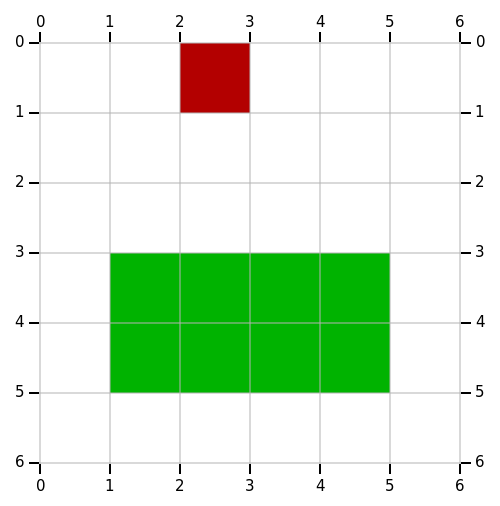

# Pixel Coordinates

## Axes directions and integer coordinates

For the layout process and for low level painting operations (typically using Cairo) pixel coordinates are used. Let's have a look at the pixel coordinate system.



The horizontal axis points from west to east and the vertical axis points from north to south. Integer coordinates, e.g. `(2,0)`, are located at the zero-width "gap" between pixels.

In the figure above, the red pixel is described by the rectangle with the two corners `(2,0)` and `(3,1)`.

## "left", "right", "top" and "bottom"

So far the words "left", "right", "top" and "bottom" were avoided. Because a `CV_Rectangle` is defined by the "top left" and "bottom right" corner, we have to define them.

In the horizontal direction we say "x1 is left of x2" (or "x2 is right of x1") if `x1 < x2`.

In the vertical direction we say "y1 is below y2" (or "y2 is above y1") if `y1 < y2`.

With this definition in mind (together with the north to south direction of the vertical axis) to "top left" corner of the red pixel is `(2,1)` and the "bottom right" corner of the red pixel is `(3,0)`.

## Examples with `CV_Rectangle`

There more ways to describe a rectangle. The constructor for `CV_Rectangle` and `cv_rect_blwh` which have the form [with `{T<:Real}`]

```julia
    CV_Rectangle(top::T, left::T, bottom::T, right::T)
    cv_rect_blwh(::Type{T}, bottom, left, width, height)
```

So the red and green rectangles in the example above can be constructed with

```julia
rect_red1 = CV_Rectangle(1, 2, 0, 3)
rect_red2 = cv_rect_blwh(Int, 0, 2, 1, 1)

rect_green1 = CV_Rectangle(5, 1, 3, 5)
rect_green2 = cv_rect_blwh(Int, 3, 1, 4, 2)
```


